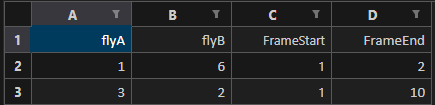

# Amys Fly Swapper Algorithm

[](https://github.com/ScottGibb/Amys-Fly-Swapper/actions/workflows/Static-Analysis.yml)


## Summary

This repo contains a simple [script](./fly_swapper.py) that will edit a fly excel sheet and allow the user to swap the fly trajectories given a range. This is due to the software sometime mixing the trajectories and thus human intervention is required.

## How to use

### Download this Repository

 To use this repo you first need to download it and setup your virtual environment. This can be done in various ways. But a windows way can be done through using the popular IDE [vscode](https://code.visualstudio.com/download).
 To do so you can follow this [tutorial](https://www.youtube.com/watch?v=ILJ4dfOL7zs).

### Set up your Virtual Environment

 I would recommend following this video for setting up virtual environments: [virtual environment in vscode tutorial](https://www.youtube.com/watch?v=O0bYaxUINnE)

### Installing dependencies

Now that your vscode(or other) virtual environment is installed, simply open the terminal(make sure your .venv is selected). You can tell by your terminal looking
similar to this:


Fear not if it doesnt! Provided you have your virtual environment created you can do the following:

```powershell
PS C:\Users\smgib_161\Documents\Projects\Amys Fly Swapper> .\.venv\Scripts\activate # This line here will activate your venv
(.venv) PS C:\Users\smgib_161\Documents\Projects\Amys Fly Swapper>
```

Setting up your virtual environment is required to get the script up and running due to it requiring the dependencies outlined in [requirements.txt](./requirements.txt). Note this command will only work if you have your virtual environment setup correctly.

```powershell
pip install -r requirements.txt
```

Okay so hopefully thats you now configured this repo...

On to the FUN part!!

## What you need to do to make it actually do something

### Fill in your sheets

In the spreadsheet that contains your flies, you must add an extra sheet called **swap**. This is so that the program knows what flies to swap and when.
For it to work correctly you must form this table here, an example is shown below as well as in the example folder [here](./example/trajectories%20(version%201).xlsb.xlsx)



In this table you will put in the flies that need to be swapped and at what frames they are swapping in and out. Both FrameStart and FrameEnd are inclusive.

So in the example above fly 1 is swapped with Fly 6 at and including frame 1 till frame 2 (inclusive). the same can be said with fly 3 and 2 from frames 1 to 10 (inclusive)

### Tell the program where your excel sheet is

### GUI Way

So you've decided you've had enough coding and you just want the damn thing to work... Well your in luck... maybe. Provided you have set up the previous sections, you should be able to do this:

```powershell
(.venv) PS C:\Users\smgib_161\Documents\Projects\Amys Fly Swapper> python .\fly_swapper.py
```

This should then fire up a GUI which will allow you to input the threshold and select a file to process.

You then should see something like this on the console:

```powershell
PS C:\Users\smgib_161\Documents\Projects\Amys Fly Swapper> .\.venv\Scripts\activate
(.venv) PS C:\Users\smgib_161\Documents\Projects\Amys Fly Swapper> python .\fly_swapper.py
INFO:root:Good job, the path .\example\trajectories (version 1).xlsb.xlsx exists!!
INFO:root:There are 15 in this spreadsheet, this means there are 7.0 flys in this sheet
INFO:root:It looks like the swap part of .\example\trajectories (version 1).xlsb.xlsx is correctly formatted!
INFO:root:Brace yourself—it's about to get bumpier than a night out with too much tequila
INFO:root:I Detected 2 swaps! Time to get swapping!!
INFO:root:Fly 1 will be swapped with fly 6 at frame 1 to frame 2
INFO:root:Fly 3 will be swapped with fly 2 at frame 1 to frame 10
INFO:root:Right about now I would start thinking about thanking scott....
(.venv) PS C:\Users\smgib_161\Documents\Projects\Amys Fly Swapper>
```

## Making an Executable

We can also make the code into an exectutable by using the following command:

```powershell
pyinstaller --onefile --name="Fly Swapper 3000" --icon=".\docs\\SG Logo.ico" --add-data ".\docs\;docs" fly_swapper.py
```

In order for this to work you will need the following dependencies.

```powershell
pip install pyinstaller
```

## Useful Links

- [Absolute vs Relative Paths](https://www.computerhope.com/issues/ch001708.htm)
- [idtracker.ai](https://idtracker.ai/latest/)
- [pyinstaller](https://pyinstaller.org/en/stable/)
