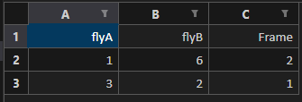

# Amys Fly Swapper Algorithm

## Summary

## How to use

### Setting up your .venv

Setting up your virtual environment is required to get the script up and running due to it requiring the dependencies outlined
in [requirements.txt](./requirements.txt)

### Installing dependencies

```bash
pip install -r requirements.txt
```

## What you need to do

In your spreadsheet you want to swap, you must add an extra sheet called swap, once added make the following table:



In this table you will put in the flies that need to be swapped and at what frame they are swapping. Then you need to go into
```fly_swapper.py``` and change the following:

```python
file_name = r".\example\trajectories (version 1).xlsb.xlsx"  # path to file + file name
```

Change this to the "Absolute" path of the file as this will give best results/ may be easier to use

## Useful Links

- [Absolute vs Relative Paths](https://www.computerhope.com/issues/ch001708.htm)
